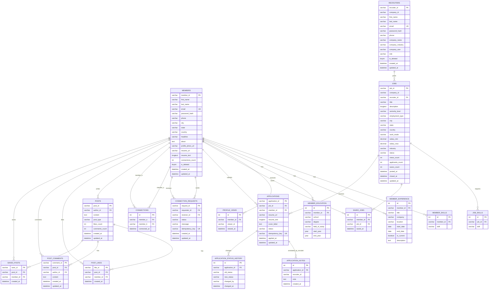
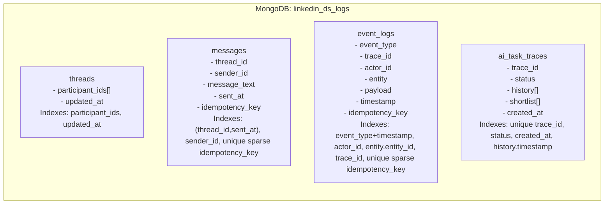

# Database Schema (MySQL + MongoDB + Redis)

## MySQL ER Diagram

## MongoDB Schema Map

## Redis Usage

Redis is used as a cache layer for high-read and gateway-adjacent workloads.

Typical patterns:

- Cache hot member/job lookups.
- Invalidate cache on update/delete.
- Reduce repeated database hits under concurrency.

