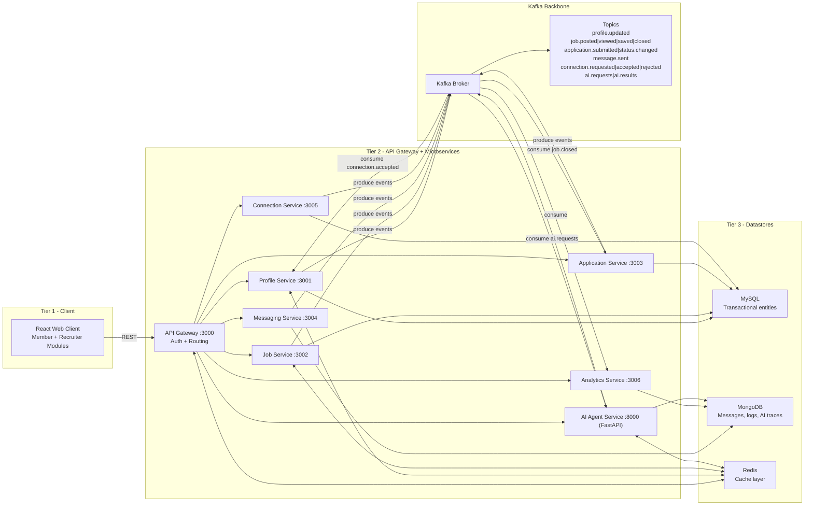

# System Architecture Diagram

## Notes

- All client traffic enters through API Gateway.
- Kafka decouples producers and consumers for async workflows.
- MySQL handles relational transactional data; MongoDB handles logs/traces/messages; Redis accelerates hot reads.

